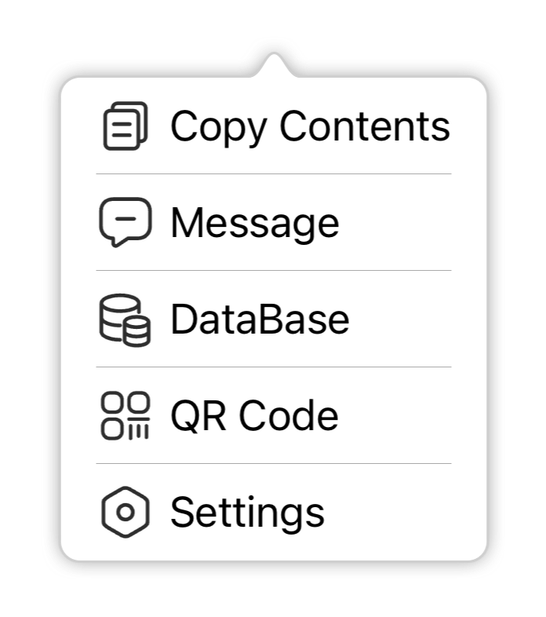
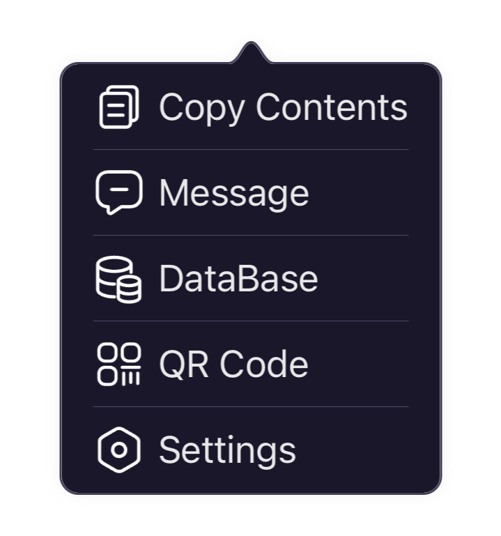
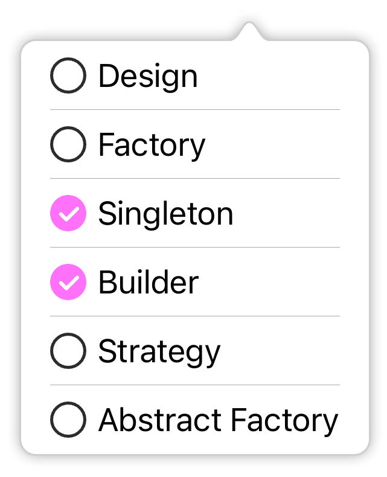

# FSPopoverView

[](https://cocoapods.org/pods/FSPopoverView)
[](https://developer.apple.com/swift/)
[](https://github.com/lifution/FSPopoverView/blob/master/README.md)
[](https://github.com/Carthage/Carthage)
[](https://github.com/lifution/FSPopoverView/blob/master/LICENSE)

FSPopoverView 是一个 popover 风格的弹窗，可自定义弹窗内容，类似 UITableView 的 data source，实现对应的协议即可自定义内容。FSPopoverView 同时提供了常用的列表功能：FSPopoverListView，该控件支持纵向和横向两个方向的布局。FSPopoverListView 中的 item 使用的是 model 驱动模式，和传统的 UITableViewCell 不一样，你只要定义 FSPopoverListItem 即可使用。

## 示例

|<div style="width: 25%">**自定义内容**</div>|<div style="width: 25%">**列表（Light）**</div>|<div style="width: 25%">**列表（Dark）**</div>|<div style="width: 25%">**列表（自定义 item）**</div>|
|:--:|:--:|:--:|:--:|
|<div style="width: 25%"></div>|<div style="width: 25%"></div>|<div style="width: 25%"></div>|<div style="width: 25%"></div>|

|**列表（横向布局）**|
|:--:|
||

## 支持功能（未勾选的还未完成）

- [x] 内容自定义
- [x] 指定箭头指向方向
- [x] 隐藏箭头
- [x] 自定义边框
- [x] 自定义阴影
- [x] 自定义显示/隐藏的转场动画
- [x] 自定义列表 item
- [x] Dark Mode（iOS13+）
- [x] 全局外观设置
- [ ] 箭头方向优先级设定
- [ ] 列表添加/删除 item
- [ ] 适配屏幕旋转

## 要求

* iOS 11+
* Swift 5
* Xcode 14+

## 安装

#### [CocoaPods](http://cocoapods.org) (推荐)

```ruby
pod 'FSPopoverView'
```

#### [Carthage](https://github.com/Carthage/Carthage)

````bash
github "lifution/FSPopoverView"
````

#### 手动复制

下载仓库后把目录下的 `FSPopoverView` 文件夹拖入你的项目中，并且勾选 `Copy items if needed` 和 `Create groups`。

## 使用

* 如果需要自定义内容，使用 FSPopoverView，实现 dataSource，按照 dataSource 的需求返回对应的内容即可。
```Swift
let popoverView = FSPopoverView()
popoverView.dataSource = self
popoverView.present(fromBarItem: barItem)

// data source
extension viewController: FSPopoverViewDataSource {
    
    func backgroundView(for popoverView: FSPopoverView) -> UIView? {
        let view = UIView()
        view.backgroundColor = .yellow
        return view
    }
    
    func contentView(for popoverView: FSPopoverView) -> UIView? {
        return contentView
    }
    
    func contentSize(for popoverView: FSPopoverView) -> CGSize {
        return .init(width: 100.0, height: 100.0)
    }
    
    func containerSafeAreaInsets(for popoverView: FSPopoverView) -> UIEdgeInsets {
        return view.safeAreaInsets
    }
    
    func popoverViewShouldDismissOnTapOutside(_ popoverView: FSPopoverView) -> Bool {
        return true
    }
}

```
* 如果需要显示一个列表，使用 FSPopoverListView。FSPopoverListView 默认提供了 FSPopoverListTextItem。FSPopoverListView 是由数据驱动的，所以你如果需要自定义 item 则需要继承 FSPopoverListItem 和 FSPopoverListCell 定制你的 item，然后把 item 传入 FSPopoverListView 即可。
```Swift
let features: [Feature] = [.copy, .message, .db, .qr, .settings]
let items: [FSPopoverListItem] = features.map { feature in
    let item = FSPopoverListTextItem()
    item.image = feature.image
    item.title = feature.title
    item.isSeparatorHidden = false
    item.selectedHandler = { item in
        guard let item = item as? FSPopoverListTextItem else {
            return
        }
        print(item.title ?? "")
    }
    item.updateLayout()
    return item
}
items.last?.isSeparatorHidden = true
let listView = FSPopoverListView()
listView.items = items
listView.present(fromRect: sender.frame.insetBy(dx: 0.0, dy: -6.0), in: view)
```
* 可通过 `FSPopoverView.fs_appearance()` 来给全局的 popover view 设置默认值。
```Swift
func application(_ application: UIApplication, didFinishLaunchingWithOptions launchOptions: [UIApplication.LaunchOptionsKey : Any]? = nil) -> Bool {
    do {
        let appearance = FSPopoverView.fs_appearance()
        appearance.showsArrow = false
        appearance.showsDimBackground = true
        ...
    }
    return true
}
```
* 详细的使用方法可查看仓库中附带的 Example 项目。

## License

FSPopoverView 基于 MIT 许可开源，更多开源许可信息可 [查看该文件](https://github.com/lifution/FSPopoverView/blob/master/LICENSE)。